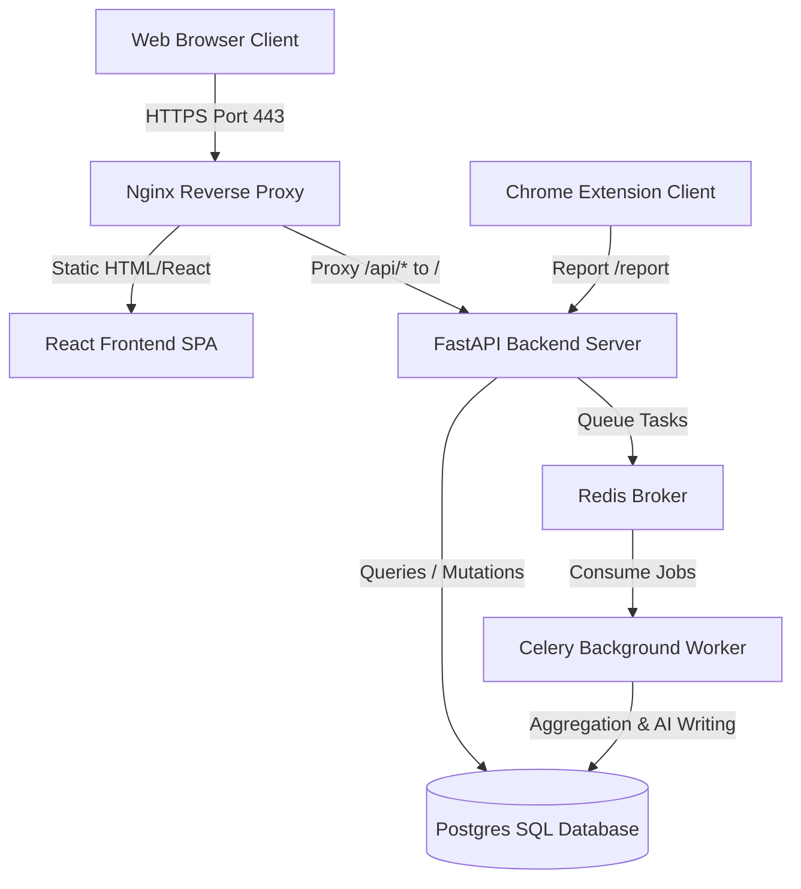

# Software Requirements Specification (SRS) - Final Version

This document outlines the final Software Requirements Specification (SRS) for PhishGuard, highlighting the modules, architectures, and features built throughout the 17 development phases.

---

## 1. Introduction

### 1.1 Purpose
PhishGuard is an enterprise security awareness training and phishing simulation platform. It helps organizations assess employee susceptibility to social engineering attacks, deliver interactive security training, and adapt educational pathways to employee risk profiles.

### 1.2 System Scope
The system consists of:
1. **FastAPI Backend REST API**: Powering data storage, tracking telemetry, and task scheduling.
2. **React SPA Frontend**: An administrative dashboard and employee training portal.
3. **Chrome Client Extension**: Enabling employees to report drill emails.
4. **Celery Worker & Redis Broker**: Executing background tasks (e.g. report compilation, database aggregations, and email alerts).
5. **PostgreSQL & SQLAlchemy**: Secure storage of organizational structure, tracking events, quiz submissions, and certificates.

---

## 2. System Architecture

---

## 3. Implemented Features

### 3.1 Authentication & Security (RBAC)
- **Session Tokens**: Uses OAuth2 cookie-based authentication. JWT tokens (`access_token` and `refresh_token`) are written directly to `httpOnly` secure cookies. No tokens reside in `localStorage`.
- **Role-Based Access Control**: Decorators and dependencies restrict endpoints to either `admin` or `employee` roles.

### 3.2 Phishing Simulation Drill Engine
- **Email Templates**: Supports theme, language, and difficulty definitions.
- **Telemetry Tracking**: Records email opens (via tracking pixel), link clicks (via redirect endpoint `/track/click/{token}`), and landing page credential inputs (via `/track/credentials/{token}`).
- **Discard Password**: Captured credentials verify that form fields are discarded on the client side before event payloads are logged, preventing plain-text password storage.

### 3.3 Dynamic Adaptive Risk Engine
- **Personal Risk Scores**: Recomputed dynamically when drill events occur or quizzes are submitted.
- **Variables**: Weight factors apply based on template difficulty, mistakes made, and user reporting speed.
- **Progression**: Passing quizzes promotes users to the next suggested difficulty tier (e.g., Easy -> Medium).

### 3.4 Interactive Compliance Training Portal
- **Assignments**: Admin users assign lessons to target departments.
- **Interactive Quizzes**: Multiple-choice grading (70% passing threshold).
- **Certificate Issuance**: Generates a dynamic PDF certificate containing user name, completion timestamp, and verification identifiers, downloadable via the UI.

### 3.5 Real-time Notification System
- **Alert Channels**: In-app notifications (newest first) and SMTP emails.
- **Trigger Events**:
  - Campaign completes.
  - Risk score falls below 50.
  - New lesson assigned.
  - Certificate issued.
  - Campaign scheduled.

### 3.6 Analytics & Heatmap Visualization
- **Heatgrid**: A colored grid displaying department-level risk parameters (average risk score, click rate, report rate) across customizable date ranges and campaigns.
- **Charts**: Interactive line and bar charts illustrating monthly risk trends, department vulnerability rankings, and campaign effectiveness.

### 3.7 Executive Narrative Reports
- **Celery Tasks**: Background compilation of organization-wide performance.
- **AI Narrative Summaries**: Incorporates AI models to construct summary summaries and 2-3 recommendations based on SQLAlchemy database queries.
- **PDF Exporting**: Converts compiled summaries and charts to a PDF document using WeasyPrint.

---

## 4. Scope Changes (Original vs. Actual)

| Feature | Original Target | Final Implementation |
| :--- | :--- | :--- |
| **Auth Tokens** | LocalStorage JWT | Refactored to secure `httpOnly` cookies to mitigate XSS vulnerabilities. |
| **Report Generation** | Synchronous rendering | Ported to Celery background tasks with Redis to prevent network timeouts during PDF rendering. |
| **Drill Submissions** | Capture credentials | Discards plain-text credentials prior to transmission, preserving audit safety. |
| **Leaderboard** | Static score boards | Features interactive ranks based on dynamic compliance completions. |
